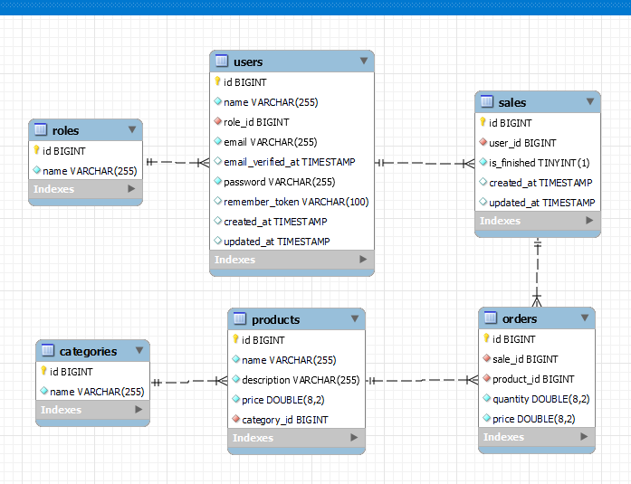

# Market REST API

## ¿En qué consiste el proyecto que quieres llevar a cabo?
Un servicio de pedidos delivery para un supermercado.

## ¿Qué problema quieres solucionar con este desarrollo?
Gestionar el inventario y los pedidos de un supermercado.

## ¿Existen alternativas ya creadas para este producto?
Si. Tomaré ideas de: [just-eat](https://www.just-eat.es).

## ¿Qué ventaja especial hace diferente tu proyecto?
No será una aplicación tan grande como [just-eat](https://www.just-eat.es) pero es trabajo honesto.

## Lista todas las funcionalidades que el usuario podrá llevar a cabo.

#### El cliente podrá:
  * Registrarse, hacer login y logout en la aplicación.
  * Actualizar datos de su perfil.
  * Ver lista de productos disponibles.
  * Filtrar productos por categoría.
  * Agregar y eliminar productos de un carrito de compra.
  * Realizar pedido.
  * Agregar rating y comentarios al recibir el pedido.
  * Ver lista de comentarios hechos por anteriores clientes. 

#### El administrador podrá:
  * Ver lista de pedidos.
  * Eliminar pedidos.
  * Crear y modificar productos.
  * Ver lista de usuarios y todos sus pedidos.

## Database Schema
